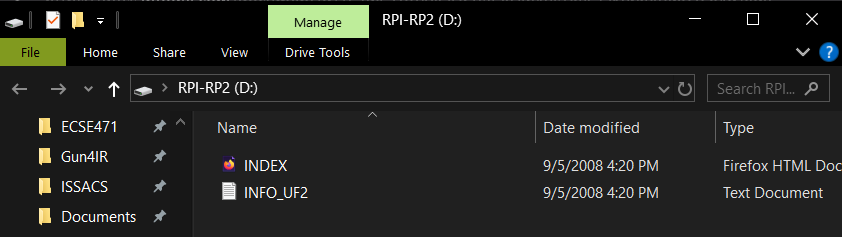

# Assembly Process

## Wire Preparation
- Cut all wires to length using a piece of cardboard as a reference length
- Stripped and twisted wires    
- Pre-soldered wires 

## Soldering wires to peripherals
- Soldered LEDs
- Soldered Sensors
- Soldered Neopixel LED bars
- Stripped and soldered the fans  

## Peripheral board Assembly
- Soldered male headers onto Peripheral boards
- Soldered peripherals to each Peripheral board
- Cleaned Peripheral boards
- Tested each Peripheral board using a test Pico with female headers soldered on 

## Pico Assembly
- Soldered the rest of the Peripheral boards to Picos
- Flashed using Thonny
- Tested each kit
	- Make sure the LED blinks two times and then lights up    
- Make sure the Neopixel bar works (will cycle a rainbow pattern)
- Make sure the calibration process finishes - Neopixel bar turns blue and then turns red
- Make sure the change in luminance on the sensor results in a corresponding change on the Neopixel bar indicator
    

## Glueing
- ### LED and Sensor Bricks
- Hot glue first on brick
- Place peripheral on layer of glue
- Finish by covering the rest of peripheral in glue
- Strain relieved the wires with a drop of hot glue
- Attached other half of brick by adding superglue to the rim and pressing them together
    
- ### Casing
- Superglue the bottom to the top of the case
- Placed Pico/Peripheral board assembly inside case
- A drop of hot glue under the Pico to hold it in place
- Final test  
      
## Finishing touches
- Pull the wires through the strain relief bars on the case
- Tie the wires with cable ties
    

  

# Uploading code onto pico

1. Hold the BOOTSEL button on the pico and plug it into computer    
2. Pico folder shows up with two files currently inside
   

4. Drag the UF2 file into the pico folder
    

4. PICO folder now closes
    
5. Open Thonny and at the bottom right corner select the COM port 
    

6. Open legobrickscript.py
    
7. Go to File > Save Copy 
    
8. When asked where to save, select the Raspberry Pi Pico
    

9. Rename file as main.py and press OK
    

10. Ctrl-D to boot the Pico
    

  
  
  
  
  
  
  
  
  
  

# Setup

- Used Studio 2.0
    

  
  

**
