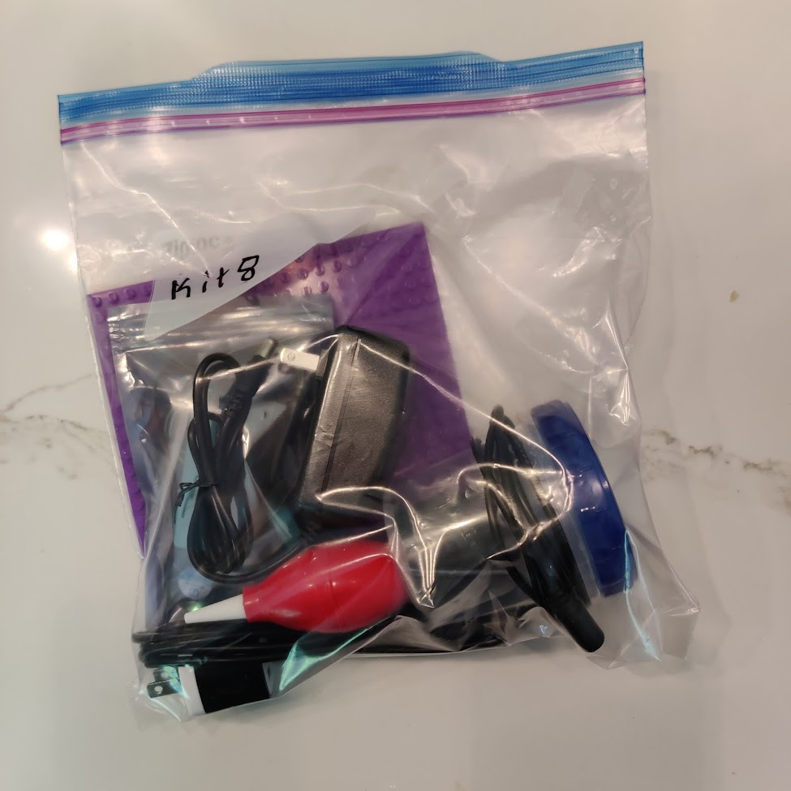
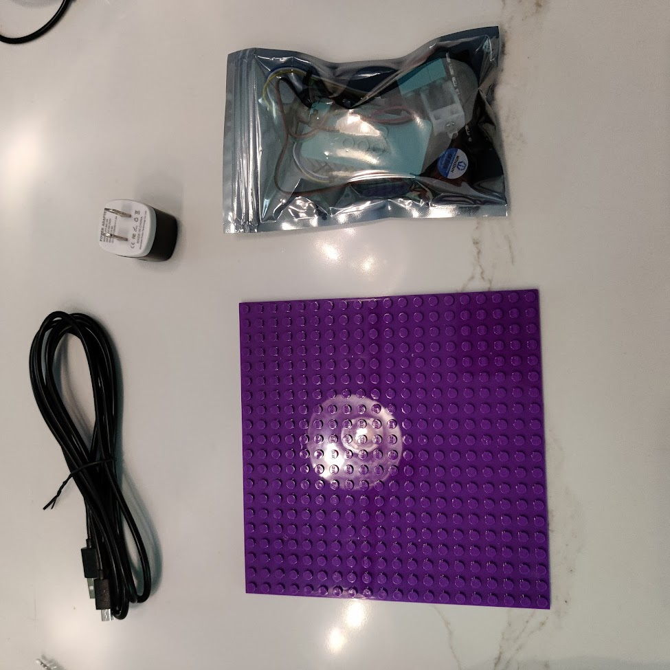
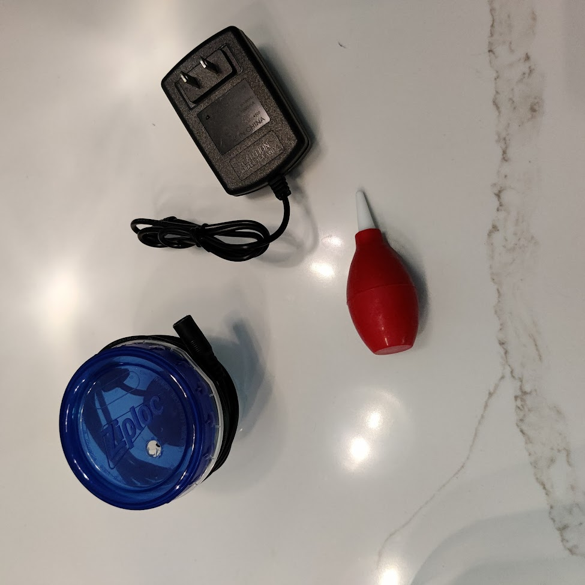
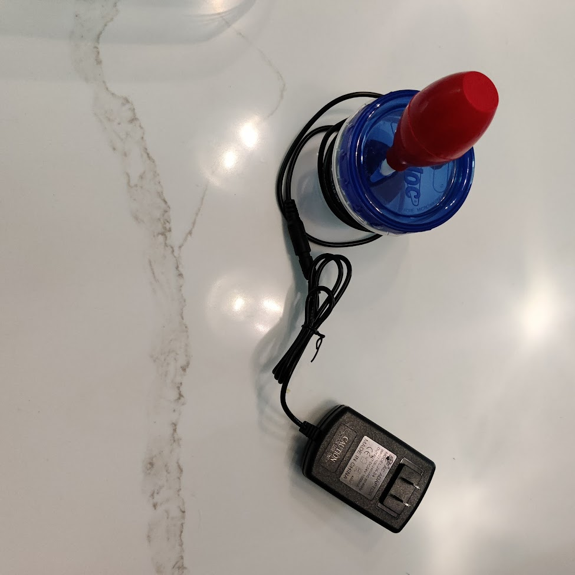

# Instructor Guide

## Before the Session

### Kit Contents

Each kit is packaged in a bag containing seven items:

1. USB wall socket
2. USB cable
3. Microcontroller package (in static-safe bag)
4. Brick baseplate
5. Mist generator and enclosure
6. Mist generator wall socket
7. Mist generator pump

### Mist Generator Assembly

> **Note:** This assembly can be incorporated into the participant program if desired —
> filling the water, assembling the pump, and plugging in the generator is a straightforward task.

1. Unscrew the lid of the mist generator and remove the red pump and white nozzle.
2. Insert the white nozzle into the side of the red pump with the tapered end pointing out.
3. Push the pump assembly into the top of the lid to create a seal.
4. Fill the container with water to the fill line — ideally 2–3 cm above the top of the mist
   generator, or about ¼ inch below the hole in the side of the container.
5. Screw the lid back on.
6. Plug the mist generator into the wall and squeeze the red pump to produce mist.

> **Troubleshooting:** If the generator lights up but produces no mist, the built-in water
> sensor is detecting insufficient water. Add more water and try again.

## Troubleshooting

Keep spare assembled units on hand — swapping a unit is almost always the fastest day-of fix.

| Symptom                                    | Day-of Fix                                                                                                  | Likely Cause                                                         | Long-term Fix                                              |
|--------------------------------------------|-------------------------------------------------------------------------------------------------------------|----------------------------------------------------------------------|------------------------------------------------------------|
| Display stops working                      | Swap from extras bag; check for solder bridges between pins                                                 | Disconnected wire or short circuit                                   | Inspect board for bridged pins; resolder display if needed |
| LED stops working                          | Swap from extras bag; check for solder bridges between pins                                                 | Disconnected wire or short circuit                                   | Inspect board for bridged pins; resolder LED if needed     |
| Fan stops blowing                          | Swap from extras bag; check for solder bridges between pins                                                 | Disconnected wire, short circuit, or internal fan failure            | Inspect board for bridged pins; resolder or replace fan    |
| Nothing happens when plugged in            | Unplug and replug; swap from extras bag                                                                     | Internal microcontroller failure                                     | Replace microcontroller                                    |
| Water spills on microcontroller            | Unplug immediately; swap from extras bag                                                                    | Water damage                                                         | Let dry completely; replace if still malfunctioning        |
| Purple lights flash — brick assembly issue | Ensure sensor brick is not exposed to outside light and is aimed 90° down the air path toward the white LED | Poor brick assembly; sensor reads similar values with LED on and off | Diagnose via USB connection; replace sensor if needed      |
| Purple lights flash — hardware issue       | If brick setup is correct, swap from extras bag                                                             | Disconnected wire or short circuit on sensor                         | Diagnose via USB connection; resolder or replace sensor    |

> **Solder bridge check:** For most hardware failures, a quick visual inspection of the
> microcontroller pins can reveal small wire fragments or solder bridges between adjacent pins.

> **Warning:** The microcontroller boards are **not waterproof**. Warn participants to keep
> their mist generators away from the boards. A small amount of mist is fine, but liquid water
> will cause board failure. Suggest using LEGO bricks under the enclosure to elevate the
> microcontroller away from the fan and any water.