# Kit Build Guide

This guide covers assembly of each component and the final board. See the
[Wiring Guide](wiring-guide.md) for pin assignments and the
[Testing Guide](testing.md) for verification steps after each stage.

## Wire Preparation

- Cut all wires to approximately 10 inches using a piece of cardboard as a reference length
- Strip approximately ¼ inch of insulation from one end of each wire
- Pre-tin stripped ends with solder before attaching to components

## LED Brick

The LED brick is a 2×4 brick split horizontally. The white LED sits lengthwise inside the
bottom half, with wires exiting through notches on the short ends. The top half is glued on
to close the brick, with a circular hole on the side for the LED to protrude through.

1. Print the LED brick top and bottom halves.
2. Solder one wire to each lead of the white LED (red for cathode/long lead, black for anode).
3. Apply shrink wrap to each solder joint and shrink with a heat gun.
4. Apply hot glue to the bottom half of the brick.
5. Lay the LED lengthwise in the bottom half with the LED body protruding through the circular
   hole, and route the wires out through the end notches.
6. Cover any remaining exposed component with hot glue. Add a drop at each wire exit for
   strain relief.
7. Apply super glue to the rim of the bottom half and press the top half firmly in place.

## Sensor Brick

The sensor brick uses the same 2×4 split brick design as the LED brick. The photoresistor sits
lengthwise inside, with its face visible through the circular hole on the side.

1. Print the sensor brick top and bottom halves.
2. Solder the blue wire (GND) to the bottom lead of the photoresistor.
3. On the top lead, solder the 10k ohm resistor and yellow wire (signal) together in a
   three-way joint.
4. Solder the white wire (+3.3V) to the other end of the resistor.
5. Apply shrink wrap in stages:
   - ⅛-inch × ⅛-inch — white wire to resistor joint
   - ¼-inch × ⅛-inch — photoresistor to blue wire joint
   - ½-inch × 4mm — three-way joint (photoresistor, resistor, yellow wire); feed through
     both white and yellow wires before shrinking
   - ½-inch × ⅜-inch — bundle all three wires and components together
6. Apply hot glue to the bottom half of the brick.
7. Lay the photoresistor lengthwise in the bottom half with its face protruding through the
   circular hole, and route the wires out through the end notches.
8. Cover any remaining exposed component with hot glue. Add a drop at each wire exit for
   strain relief.
9. Apply super glue to the rim of the bottom half and press the top half firmly in place.

## Neopixel Assembly

1. Cut and strip three wires to 10 inches with ¼ inch exposed on one end.
2. Place the Neopixel strip on a heat-proof surface with solder pads facing up. Tape it down.
3. Apply solder paste to the pads.
4. Align wires with pads and solder. Minimize exposed wire to avoid weak points.

## PCB Assembly

The PCB (design files in `pcb/`) connects all components to the Pico. The Pico solders
directly to the PCB.

1. Solder male headers onto the PCB.
2. Solder the LED brick, sensor brick, Neopixel, and fan wires to the PCB per the
   [Wiring Guide](wiring-guide.md).
3. Clean the PCB.
4. Test the PCB using a test Pico with female headers — see [Testing Guide](testing.md).
5. Equalize all wire lengths and ensure each has approximately ¼ inch of exposed wire.
6. Solder the Neopixel brick to the Pico first. Orient the Pico with the processor facing up
   — this gives a clean connection to the PCB and makes components visible to participants.
7. Test before continuing — see [Testing Guide](testing.md).
8. Solder the sensor bricks and fan following the wiring guide.
9. Run full board testing.

## Pico Case Assembly

1. Place the Pico and PCB assembly inside the Pico case.
2. Apply a drop of hot glue under the Pico to hold it in place.
3. Superglue the case bottom to the top.
4. Pull wires through the strain relief bars and tie with cable ties.

## Flashing Firmware

1. Hold the BOOTSEL button on the Pico and plug it into a computer via USB. The Pico will
   appear as a USB drive.

   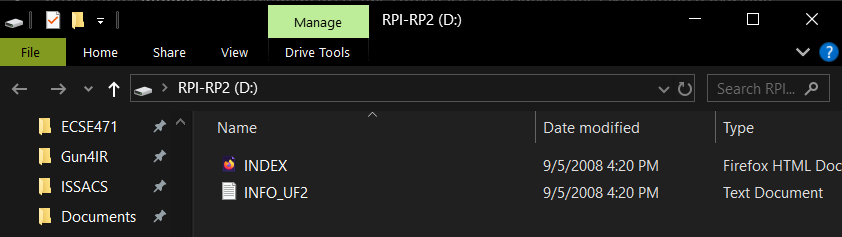

2. Download the MicroPython UF2 from
   [micropython.org/download/RPI_PICO](https://micropython.org/download/RPI_PICO/) and drag
   it onto the Pico drive. The drive will disconnect automatically.

   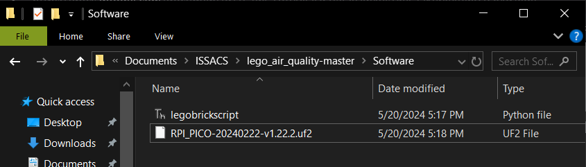

3. Open Thonny and select the correct COM port in the bottom-right corner.

   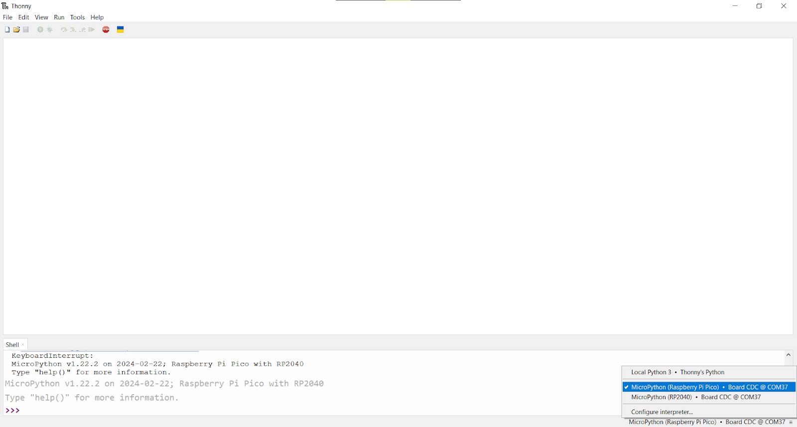

4. Open `firmware/main.py` from this repository. Go to **File > Save Copy**, select
   **Raspberry Pi Pico** when prompted, and save as `main.py`.

   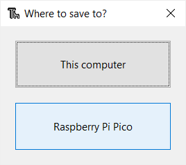

   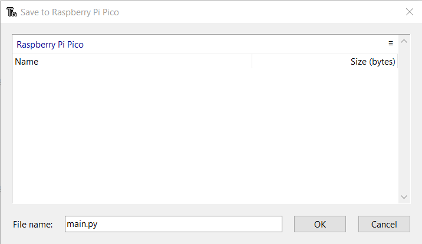

5. Press Ctrl+D to reboot. The firmware will run automatically.

## LEGO Model Setup

Use [BrickLink Studio](https://www.bricklink.com/v3/studio/download.page) to view or modify
the LEGO assembly layout. The Studio file is at `legos/legos_layout.io`.

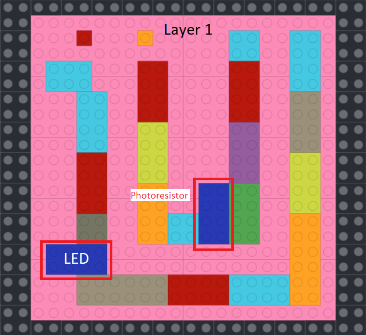
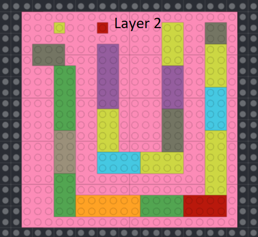
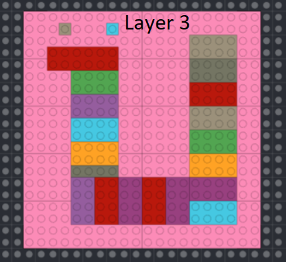
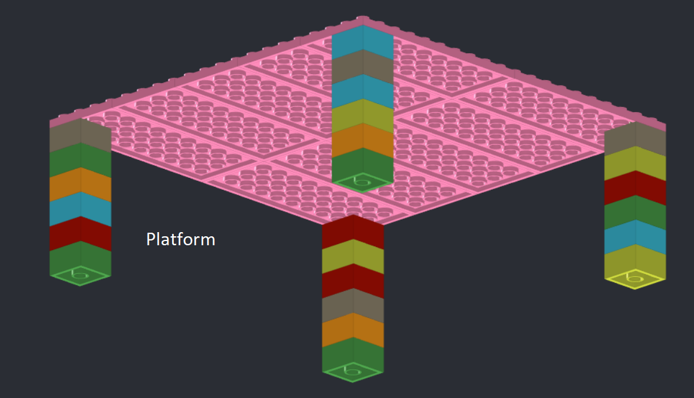
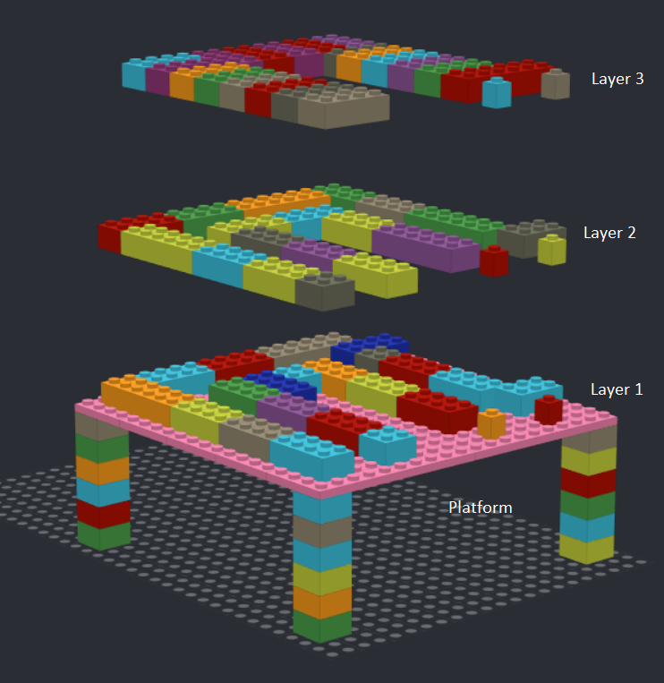
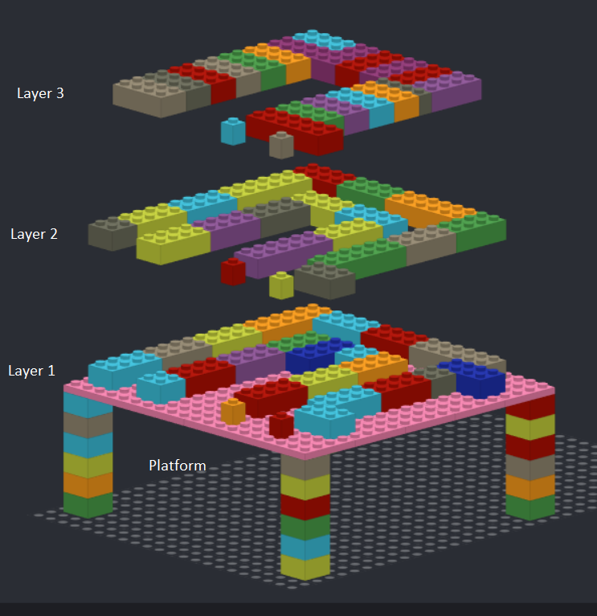
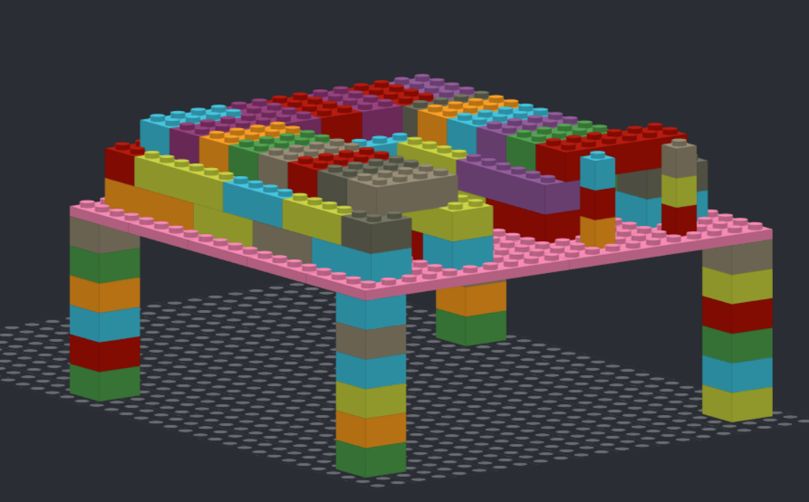
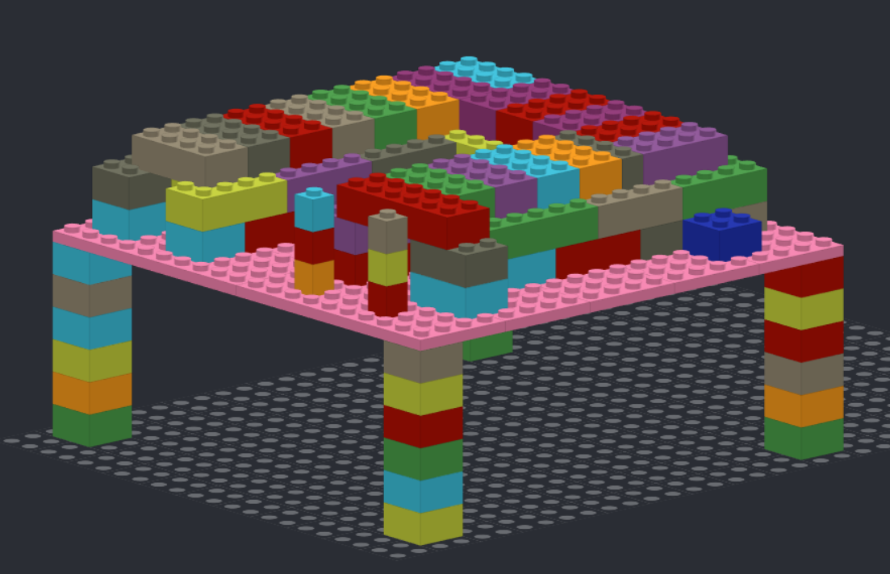
