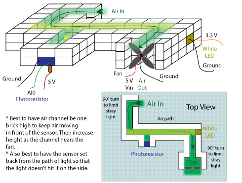
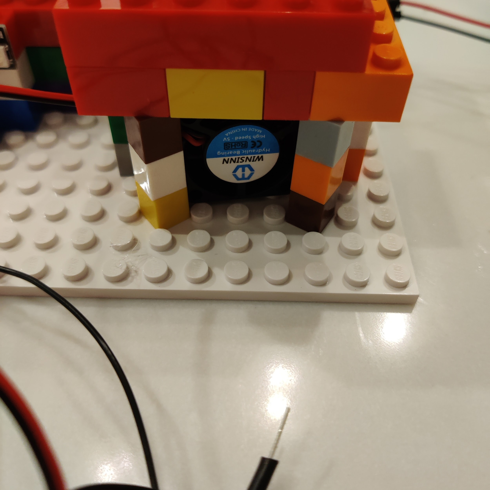

# Build Tutorial

Follow these steps to assemble your air quality monitor.

## Step 1: Build the Enclosure

Using the provided LEGO bricks, build the enclosure around the pre-assembled sensor and LED
components following the diagram below.

## Step 2: Install the Fan

When installing the fan, make sure air is being **pushed into** the enclosure — not pulled out.
The LEGO structure has enough gaps and holes that pulling air through the other end won't create
sufficient suction.

## Step 3: Power On

Plug the micro-USB cable into the microcontroller, then plug the USB end into the wall socket.

## Step 4: Startup Sequence

The LED bar will go through a startup and calibration sequence automatically:

| LED Display                   | Meaning                                                                  |
|-------------------------------|--------------------------------------------------------------------------|
| Rainbow animation (~1 second) | Power is applied correctly                                               |
| Solid yellow                  | Calibration stage 1 — sensor check                                       |
| Solid cyan                    | Calibration stage 2 — baseline capture                                   |
| Purple flashing (5 cycles)    | Error detected — see [Troubleshooting](#troubleshooting)                 |
| Red or off LEDs               | Ready — measuring air quality                                            |

> **Important:** Do not introduce any smoke or particulate matter during the yellow or cyan
> calibration stages. If the system calibrates with polluted air present, readings will be
> incorrect.

## Step 5: Taking Readings

Once the LED bar shows red or off LEDs, the system is measuring. The number of lit LEDs
represents the relative air quality — more LEDs means more pollution detected.

The system measures *relative* to what it has seen since it was turned on. Early readings may
seem off (e.g., showing 6 out of 8 LEDs even in clean air). Once exposed to a range of air
quality values, the display will adjust and become more meaningful.

## Troubleshooting

**Purple lights are flashing:**

- Make sure the sensor brick is not exposed to outside light — it should be enclosed within
  the LEGO structure.
- Check that the sensor brick is aimed directly down the air channel toward the white LED brick
  at a 90° angle.
- If the brick setup looks correct, there may be a hardware issue — ask your instructor for
  a replacement unit.
